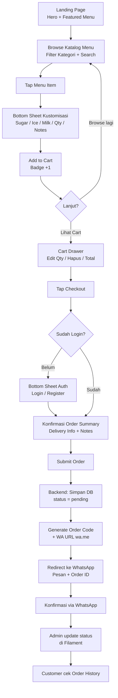
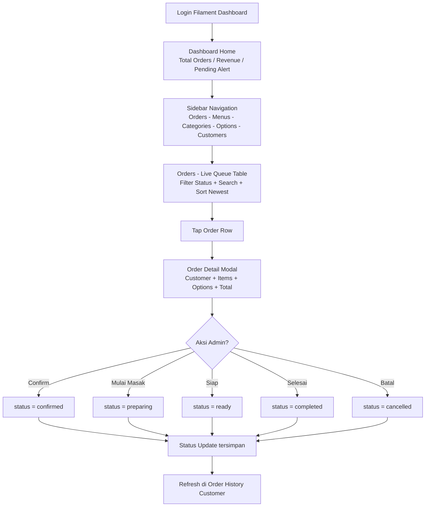
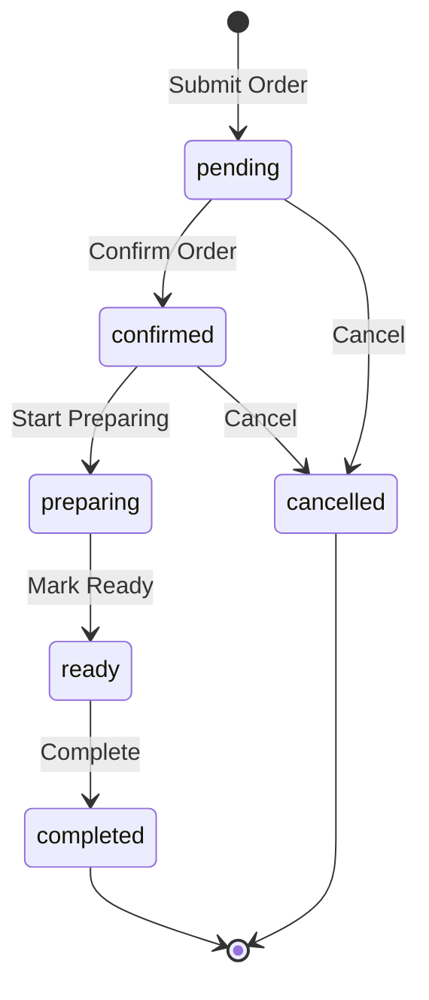
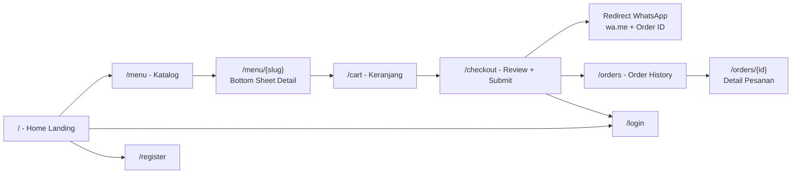
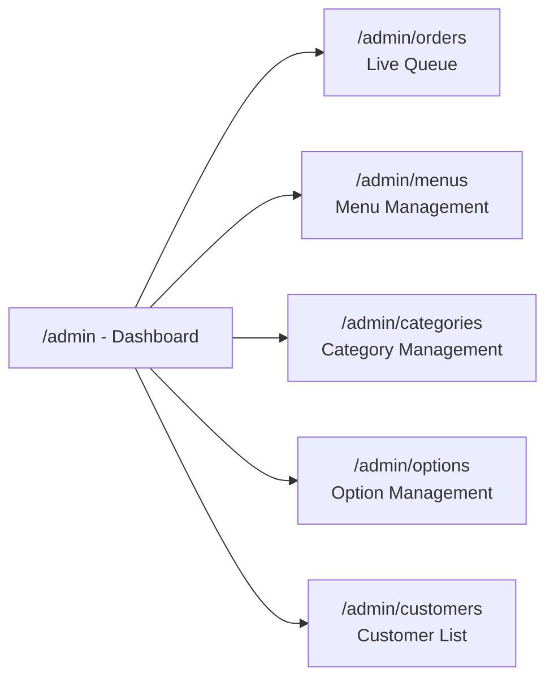

# Project Brief: Coffee Shop Web Application

## 1. Project Overview & Objectives

**Nama Proyek:** Coffee Shop Web Application  
**Tipe Proyek:** Full Stack Web Application (E-Commerce Coffee Shop)  
**Durasi:** 4 Minggu (4 Sprint)  
**Tim:** Solo Developer (AI-Assisted Vibe Coding)

### Deskripsi Umum
Aplikasi web coffee shop modern yang menyediakan katalog menu interaktif dengan fitur kustomisasi pesanan (sugar level, ice level, milk options), sistem checkout terintegrasi WhatsApp, dan admin dashboard berbasis Laravel Filament v3 untuk manajemen order queue dan inventory.

### Tujuan Utama
- **Customer Experience:** Menyediakan katalog menu yang mudah dinavigasi dengan proses checkout yang cepat dan intuitif
- **Business Operations:** Memberikan admin/kasir dashboard yang powerful untuk mengelola menu, kategori, varian, dan antrian pesanan real-time
- **Portfolio Goal:** Menghasilkan case study UI/UX yang solid untuk portofolio dengan design system monochrome modern

---

## 2. Core Features & Scope

### 2.1 Fitur Sisi Pelanggan (Customer-Facing)

#### MVP (Must-Have) - Sprint 1-3
- **Katalog Produk/Jasa**
  - Grid katalog menu dengan gambar, nama, harga, dan badge kategori
  - Filter berdasarkan kategori (Coffee, Non-Coffee, Snacks)
  - Search bar untuk pencarian menu cepat
  
- **Form Input Pesanan & Kustomisasi**
  - Bottom sheet drawer untuk kustomisasi:
    - Sugar Level (0%, 25%, 50%, 75%, 100%)
    - Ice Level (No Ice, Less Ice, Normal Ice, Extra Ice)
    - Milk Options (Regular, Oat Milk, Almond Milk, Soy Milk)
  - Quantity selector (+/- button)
  - Special notes/catatan tambahan
  
- **Shopping Cart (Keranjang Belanja)**
  - Sticky bottom checkout bar menampilkan total item & harga
  - Cart drawer dengan daftar item, edit quantity, dan hapus item
  - Kalkulasi otomatis subtotal, tax (jika ada), dan total
  
- **Authentication System**
  - Guest browsing allowed (lihat menu tanpa login)
  - Required login untuk checkout
  - Registration & Login form (Email/Phone + Password)
  - Laravel Breeze/Fortify dengan custom Blade + Alpine.js view
  - Bottom sheet auth drawer untuk flow yang seamless
  
- **Checkout Flow (Unified: Database + WhatsApp)**
  1. User tap "Checkout" → Validasi login
  2. Sistem simpan order ke database (status: `pending`)
  3. Order muncul di Filament Dashboard
  4. Auto-generate WhatsApp URL dengan format pesan + Order ID
  5. Redirect user ke WhatsApp untuk konfirmasi ke nomor toko
  
- **Order History Page**
  - Menampilkan status pesanan aktif (pending, processing, completed)
  - Riwayat transaksi lama dengan detail item
  - Filter berdasarkan status dan tanggal

#### Phase 2 (Nice-to-Have) - Post-Launch
- Fitur diskusi/ulasan produk
- Integrasi WhatsApp API otomatis (kirim pesan tanpa redirect manual)
- Program loyalitas/poin pelanggan
- Dashboard analytics & laporan POS
- Multi-language support & dark mode

### 2.2 Fitur Admin Dashboard (Laravel Filament v3)

#### MVP (Must-Have) - Sprint 1 & 3
- **Manajemen Kategori**
  - CRUD kategori menu (Coffee, Non-Coffee, Snacks, etc.)
  - Upload icon/gambar kategori
  - Set urutan tampil (sorting)
  
- **Manajemen Menu**
  - CRUD menu item dengan:
    - Nama, deskripsi, harga, gambar
    - Relasi ke kategori
    - Status (available/unavailable)
  - Bulk actions untuk update stok/status
  
- **Manajemen Varian/Opsi**
  - CRUD custom options:
    - Sugar Level (value: 0, 25, 50, 75, 100)
    - Ice Level (value: none, less, normal, extra)
    - Milk Type (value: regular, oat, almond, soy)
  - Set harga tambahan per opsi (misal Oat Milk +Rp 5.000)
  
- **Live Order Queue (Antrian Pesanan Kasir)**
  - Tabel real-time order dengan status workflow:
    - `pending` → `confirmed` → `preparing` → `ready` → `completed`
  - Filter berdasarkan status, tanggal, dan customer
  - Detail drawer order dengan:
    - Customer info (nama, phone, delivery address/table)
    - List item dengan kustomisasi
    - Total harga
    - Timestamp order
  - Action buttons: Confirm, Cancel, Mark as Ready, Complete
  
- **Customer Management**
  - View customer list dengan order history
  - Filter berdasarkan frequent buyer

#### Phase 2 (Nice-to-Have)
- Dashboard analytics (revenue, top products, customer insights)
- Export laporan PDF/Excel
- Integrasi payment gateway (Midtrans, Xendit)
- Notifikasi real-time ke kitchen display system

---

## 3. Tech Stack & Architecture

### 3.1 Backend & Core Framework
- **Framework:** Laravel 11.x (PHP 8.2+)
- **Database:** MySQL 8.0+ / PostgreSQL 14+
- **ORM:** Eloquent ORM
- **Authentication:** Laravel Breeze / Fortify
- **Admin Panel:** Laravel Filament v3 (Latest Stable)

### 3.2 Frontend & UI Layer
- **Templating:** Blade Components
- **CSS Framework:** Tailwind CSS v3.x
- **JavaScript Framework:** Alpine.js v3.x (untuk interaktivitas)
- **Asset Bundler:** Vite (Laravel default)

### 3.3 Third-Party Integrations
- **WhatsApp Gateway:** WhatsApp Web API (`wa.me` URL scheme)
- **Image Storage:** Laravel Storage (local/S3)
- **Seeding & Faker:** Laravel Seeder dengan Faker untuk dummy data

### 3.4 Development Tools
- **AI Pair Programming:** Cursor IDE, Kiro, Hermes
- **Version Control:** Git + GitHub/GitLab
- **Design Tool:** Figma (untuk transfer UI di Sprint 4)
- **Testing:** PHPUnit (Laravel default)

### 3.5 Architecture Pattern
- **MVC Pattern:** Laravel default structure
- **Service Layer (Optional):** Untuk business logic kompleks (OrderService, CheckoutService)
- **Repository Pattern (Optional):** Jika diperlukan untuk abstraksi data layer
- **Livewire/Alpine Hybrid:** Filament menggunakan Livewire, Frontend customer menggunakan Alpine.js

---

## 4. Database Schema & Data Structure

### 4.1 Entity Relationship Diagram (ERD) Sederhana

```
┌─────────────┐       ┌──────────────┐       ┌─────────────┐
│  categories │◄──────┤    menus     │◄──────┤   options   │
│             │ 1   n │              │ n   n │             │
│ - id        │       │ - id         │       │ - id        │
│ - name      │       │ - name       │       │ - name      │
│ - slug      │       │ - category_id│       │ - type      │
│ - image     │       │ - price      │       │ - value     │
│ - order     │       │ - image      │       │ - extra_fee │
└─────────────┘       │ - status     │       └─────────────┘
                      └──────────────┘
                             ▲ 
                             │ n
                             │
                      ┌──────┴───────┐
                      │ order_items  │
                      │              │
                      │ - id         │
                      │ - order_id   │
                      │ - menu_id    │
                      │ - quantity   │
                      │ - price      │
                      │ - options    │ (JSON)
                      └──────────────┘
                             │ n
                             ▼ 1
                      ┌──────────────┐
                      │    orders    │
                      │              │
                      │ - id         │
                      │ - user_id    │
                      │ - order_code │
                      │ - status     │
                      │ - total      │
                      │ - notes      │
                      │ - timestamps │
                      └──────────────┘
                             ▲ n
                             │ 1
                      ┌──────┴───────┐
                      │    users     │
                      │              │
                      │ - id         │
                      │ - name       │
                      │ - email      │
                      │ - phone      │
                      │ - password   │
                      └──────────────┘
```

### 4.2 Table Definitions

#### **categories**
| Column | Type | Description |
|--------|------|-------------|
| id | bigint unsigned | Primary key |
| name | varchar(255) | Nama kategori (Coffee, Snacks) |
| slug | varchar(255) | URL-friendly identifier |
| image | varchar(255) | Path gambar kategori |
| order | integer | Urutan tampil |
| created_at | timestamp | |
| updated_at | timestamp | |

#### **menus**
| Column | Type | Description |
|--------|------|-------------|
| id | bigint unsigned | Primary key |
| category_id | bigint unsigned | Foreign key ke categories |
| name | varchar(255) | Nama menu item |
| slug | varchar(255) | URL-friendly identifier |
| description | text | Deskripsi produk |
| price | decimal(10,2) | Harga dasar |
| image | varchar(255) | Path gambar produk |
| status | enum('available','unavailable') | Status stok |
| created_at | timestamp | |
| updated_at | timestamp | |

#### **options**
| Column | Type | Description |
|--------|------|-------------|
| id | bigint unsigned | Primary key |
| type | enum('sugar','ice','milk') | Tipe opsi |
| name | varchar(255) | Label display (e.g., "50% Sugar") |
| value | varchar(50) | Value internal (e.g., "50") |
| extra_fee | decimal(8,2) | Biaya tambahan (default 0) |
| created_at | timestamp | |
| updated_at | timestamp | |

#### **menu_option** (Pivot Table - Many-to-Many)
| Column | Type | Description |
|--------|------|-------------|
| id | bigint unsigned | Primary key |
| menu_id | bigint unsigned | Foreign key ke menus |
| option_id | bigint unsigned | Foreign key ke options |

#### **users**
| Column | Type | Description |
|--------|------|-------------|
| id | bigint unsigned | Primary key |
| name | varchar(255) | Nama customer |
| email | varchar(255) | Email (unique) |
| phone | varchar(20) | Nomor telepon |
| password | varchar(255) | Hashed password |
| email_verified_at | timestamp | |
| remember_token | varchar(100) | |
| created_at | timestamp | |
| updated_at | timestamp | |

#### **orders**
| Column | Type | Description |
|--------|------|-------------|
| id | bigint unsigned | Primary key |
| user_id | bigint unsigned | Foreign key ke users |
| order_code | varchar(50) | Unique order ID (e.g., ORD-20260929-001) |
| status | enum('pending','confirmed','preparing','ready','completed','cancelled') | Status workflow |
| subtotal | decimal(10,2) | Subtotal item |
| tax | decimal(10,2) | Pajak (optional) |
| total | decimal(10,2) | Total akhir |
| notes | text | Catatan customer |
| delivery_info | json | Alamat/table number (nullable) |
| created_at | timestamp | Waktu order |
| updated_at | timestamp | |

#### **order_items**
| Column | Type | Description |
|--------|------|-------------|
| id | bigint unsigned | Primary key |
| order_id | bigint unsigned | Foreign key ke orders |
| menu_id | bigint unsigned | Foreign key ke menus |
| quantity | integer | Jumlah item |
| price | decimal(10,2) | Harga per unit (snapshot saat order) |
| selected_options | json | Custom options yang dipilih: `{"sugar": "50", "ice": "normal", "milk": "oat"}` |
| created_at | timestamp | |
| updated_at | timestamp | |

### 4.3 Relasi Eloquent

```php
// Category Model
public function menus() {
    return $this->hasMany(Menu::class);
}

// Menu Model
public function category() {
    return $this->belongsTo(Category::class);
}
public function options() {
    return $this->belongsToMany(Option::class, 'menu_option');
}
public function orderItems() {
    return $this->hasMany(OrderItem::class);
}

// Option Model
public function menus() {
    return $this->belongsToMany(Menu::class, 'menu_option');
}

// User Model
public function orders() {
    return $this->hasMany(Order::class);
}

// Order Model
public function user() {
    return $this->belongsTo(User::class);
}
public function items() {
    return $this->hasMany(OrderItem::class);
}

// OrderItem Model
public function order() {
    return $this->belongsTo(Order::class);
}
public function menu() {
    return $this->belongsTo(Menu::class);
}
```

---

## 5. User Flow & Navigation

### 5.1 Customer Journey Flowchart



### 5.2 Admin / Kasir Workflow Flowchart (Filament)



**Order Status State Diagram:**



### 5.3 Sitemap & Navigation Flowchart

**Customer Frontend:**



**Admin Filament Dashboard:**



---

## 6. UI/UX & Visual Guidelines

### 6.1 Design Philosophy
**Konsep:** Clean, Modern, Minimalist, Mobile-First UI (Anti AI-Slop)  
**Target Device:** Mobile Viewport Primary (390px), Responsive hingga Desktop (1440px)  
**Design System:** Monochrome Color System dengan Flat Design & Subtle Outlines

### 6.2 Color Palette (Monochrome System)

| Color Name | Hex Code | Usage |
|------------|----------|-------|
| **Primary Black** | `#0D0D0D` | Text utama, Header, CTA Button background |
| **Background White** | `#FFFFFF` | Body background, Card background |
| **Light Neutral Gray** | `#F5F5F7` | Section background, Hover state |
| **Subtle Border** | `#E5E5EA` | Border, Divider, Outline |
| **Success Green** | `#34C759` | Status badge (completed, available) |
| **Warning Orange** | `#FF9500` | Status badge (preparing) |
| **Error Red** | `#FF3B30` | Status badge (cancelled), Validation error |

**Tailwind Config:**
```js
colors: {
  primary: '#0D0D0D',
  background: '#FFFFFF',
  neutral: '#F5F5F7',
  border: '#E5E5EA',
  success: '#34C759',
  warning: '#FF9500',
  error: '#FF3B30',
}
```

### 6.3 Typography System

**Font Family:**
- Primary: `Inter` (Google Fonts)
- Alternative: `Plus Jakarta Sans`

**Type Scale:**
```css
/* Heading */
.h1 { font-size: 32px; font-weight: 700; line-height: 1.2; }
.h2 { font-size: 24px; font-weight: 700; line-height: 1.3; }
.h3 { font-size: 20px; font-weight: 600; line-height: 1.4; }

/* Body */
.body-lg { font-size: 16px; font-weight: 500; line-height: 1.5; }
.body-md { font-size: 14px; font-weight: 400; line-height: 1.5; }
.body-sm { font-size: 12px; font-weight: 400; line-height: 1.4; }

/* Label */
.label { font-size: 14px; font-weight: 600; text-transform: uppercase; letter-spacing: 0.5px; }
```

### 6.4 Spacing & Layout System

**Grid System:** 16px Base Unit (Tailwind default)

| Token | Value | Usage |
|-------|-------|-------|
| xs | 4px | Icon margin, tight spacing |
| sm | 8px | Button padding vertical |
| md | 16px | Default padding/margin |
| lg | 24px | Section spacing |
| xl | 32px | Large section gap |
| 2xl | 48px | Hero section padding |

**Mobile Viewport:** 390px (iPhone 14/15 Pro Standard)  
**Container Padding:** 16px (horizontal)  
**Max Content Width:** 1200px (Desktop)

### 6.5 Component Design Specs

#### **Button**
```
Primary Button (CTA):
- Background: #0D0D0D
- Text: #FFFFFF
- Border Radius: 8px
- Padding: 12px 24px
- Font: 16px Medium
- Hover: Background → #2D2D2D

Secondary Button (Outline):
- Background: Transparent
- Text: #0D0D0D
- Border: 1px solid #E5E5EA
- Border Radius: 8px
- Padding: 12px 24px
- Hover: Background → #F5F5F7
```

#### **Card (Menu Item)**
```
- Background: #FFFFFF
- Border: 1px solid #E5E5EA
- Border Radius: 12px
- Padding: 0 (Image full bleed)
- Shadow: None (Flat Design)
- Hover: Border → #0D0D0D (1px solid)

Structure:
[Image: 16:9 ratio, Cover fit]
[Content Padding: 16px]
  ├─ [Title: H3 Bold]
  ├─ [Description: Body-sm, 2 lines clamp]
  └─ [Price: Body-lg Bold + Add Button]
```

#### **Input Field**
```
- Background: #FFFFFF
- Border: 1px solid #E5E5EA
- Border Radius: 8px
- Padding: 12px 16px
- Font: 16px Regular
- Focus: Border → #0D0D0D (2px solid)
- Placeholder: #999999
```

#### **Bottom Sheet / Drawer**
```
- Background: #FFFFFF
- Border Radius: 16px 16px 0 0 (Top rounded)
- Backdrop: rgba(0,0,0,0.4)
- Max Height: 85vh
- Animation: Slide up from bottom (0.3s ease)

Header:
- Padding: 16px
- Border Bottom: 1px solid #E5E5EA
- [Drag Handle: 32px width, 4px height, #E5E5EA, centered]
```

#### **Badge (Status)**
```
- Background: Status color (10% opacity)
- Text: Status color (100% opacity)
- Border Radius: 6px
- Padding: 4px 8px
- Font: 12px Semibold

Examples:
- Pending: Background #FF9500 10%, Text #FF9500
- Completed: Background #34C759 10%, Text #34C759
```

#### **Sticky Checkout Bar**
```
- Position: Fixed bottom
- Background: #0D0D0D
- Padding: 16px
- Shadow: 0 -4px 12px rgba(0,0,0,0.1)

Layout:
[Left: Total Badge (#FFFFFF bg, #0D0D0D text)]
[Right: Checkout Button (#FFFFFF text, tap → scale 0.98)]
```

### 6.6 Interaction & Motion

**Tap Target:** Minimum 44x44px (iOS Guideline)  
**Hover State:** Background change + Border color change (no scale/shadow overkill)  
**Active State:** Scale down (0.98) untuk button press feedback  
**Transition Duration:** 0.2s ease-out (default untuk semua interaksi)

**Animation Guidelines:**
- Bottom Sheet: Slide up from bottom (0.3s cubic-bezier)
- Modal: Fade in + Scale dari 0.95 → 1.0 (0.25s)
- Cart Badge Update: Bounce animation (ketika item ditambah)
- Loading State: Subtle shimmer skeleton (tidak pakai spinner berlebihan)

### 6.7 Responsive Breakpoints (Mobile-First)

**Pendekatan:** Semua keputusan layout, tipografi, dan interaksi dirancang untuk layar ponsel (390px) terlebih dahulu, lalu ditingkatkan (scaled-up) ke tablet dan desktop. Desktop adalah versi *responsive* dari hierarki mobile, bukan halaman terpisah.

| Breakpoint | Width | Grid | Komponen Utama |
|------------|-------|------|----------------|
| Mobile (base) | 320–767px | 1 kolom | Stack vertical, Bottom sheet full-width (max 85vh), Sticky bar bawah |
| Tablet | 768–1023px | 2 kolom | Side drawer 420px dari kanan mengganti bottom sheet, Grid catalog 2 kolom |
| Desktop | 1024px+ | 3–4 kolom | Side drawer tetap, Navbar penuh, Konten max 1200px centered |

**Aturan tambahan:**
- Touch target minimal 44×44px di semua breakpoint; hover hanyalah enhancement.
- Container padding: 16px (mobile) → 24px (tablet) → 32px (desktop, max 1200px).
- Halaman form (checkout) diberi batas bacaan 780px (`shell--narrow`) untuk keterbacaan.
- Dilarang ada horizontal scroll di breakpoint manapun.

### 6.8 Iconography

**Icon Set:** Lucide Icons / Heroicons (Outline style)  
**Icon Size:**
- Small: 16x16px
- Medium: 20x20px
- Large: 24x24px

**Icon Color:** Inherit from parent text color (default #0D0D0D)

### 6.9 Figma Design System Checklist (Sprint 4)

Dokumen yang akan ditransfer ke Figma:
- [ ] Color Palette (Styles)
- [ ] Typography System (Text Styles)
- [ ] Spacing System (Auto Layout)
- [ ] Button Component (Variants: Primary, Secondary, Disabled)
- [ ] Input Field Component (States: Default, Focus, Error)
- [ ] Card Component (Menu Item, Order Card)
- [ ] Bottom Sheet Component
- [ ] Badge Component (Status Variants)
- [ ] Mobile Frames (Home, Menu, Cart, Checkout, Order History)
- [ ] Desktop Frames (optional untuk presentasi)

---

## 7. Milestones & Implementation Checklist

### Sprint 1 (Minggu 1): Foundation & Backend Setup
**Goal:** Setup project Laravel, database schema, dan konfigurasi Filament Admin

**Checklist:**
- [ ] **Project Initialization**
  - [ ] Install Laravel 11.x via Composer
  - [ ] Setup Git repository & `.gitignore`
  - [ ] Configure `.env` (database, app name, timezone)
  - [ ] Install Laravel Breeze/Fortify untuk authentication
  
- [ ] **Database Design**
  - [ ] Create migrations:
    - [ ] `create_categories_table`
    - [ ] `create_menus_table`
    - [ ] `create_options_table`
    - [ ] `create_menu_option_table` (pivot)
    - [ ] `create_orders_table`
    - [ ] `create_order_items_table`
  - [ ] Create Eloquent Models dengan relasi
  - [ ] Create Seeders:
    - [ ] `CategorySeeder` (5 kategori dummy)
    - [ ] `MenuSeeder` (20 menu dummy dengan Faker images)
    - [ ] `OptionSeeder` (Sugar, Ice, Milk variants)
    - [ ] `UserSeeder` (1 admin, 5 customer dummy)
  - [ ] Run `php artisan migrate --seed`
  
- [ ] **Laravel Filament v3 Installation**
  - [ ] Install Filament: `composer require filament/filament`
  - [ ] Run `php artisan filament:install --panels`
  - [ ] Create admin user: `php artisan make:filament-user`
  - [ ] Create Filament Resources:
    - [ ] `CategoryResource` (CRUD + image upload)
    - [ ] `MenuResource` (CRUD + image upload + relasi kategori)
    - [ ] `OptionResource` (CRUD + enum type select)
    - [ ] `OrderResource` (Read-only table dengan status filter)
    - [ ] `CustomerResource` (User list dengan role filter)
  - [ ] Configure Filament Navigation & Icons
  
- [ ] **Vite & Tailwind Setup**
  - [ ] Install Tailwind: `npm install -D tailwindcss`
  - [ ] Configure `tailwind.config.js` (custom colors)
  - [ ] Create `resources/css/app.css` dengan base styles
  - [ ] Run `npm run dev` untuk testing

**Deliverables:**
- Laravel project dengan database terseeder
- Filament Admin accessible di `/admin`
- CRUD menu & kategori berfungsi sempurna

---

### Sprint 2 (Minggu 2): Frontend Katalog & Shopping Cart
**Goal:** Pengembangan katalog menu customer-facing dengan Alpine.js interactivity

**Checklist:**
- [ ] **Blade Layout & Components**
  - [ ] Create `resources/views/layouts/app.blade.php` (main layout)
  - [ ] Create Blade Components:
    - [ ] `<x-navbar />` (Logo, Search bar, Cart badge)
    - [ ] `<x-menu-card />` (Image, Title, Price, Add button)
    - [ ] `<x-category-filter />` (Horizontal scroll pills)
    - [ ] `<x-bottom-sheet />` (Reusable drawer component)
    - [ ] `<x-cart-drawer />` (Shopping cart sidebar)
  
- [ ] **Home/Landing Page**
  - [ ] Route: `Route::get('/', [HomeController::class, 'index'])`
  - [ ] Hero Section (Coffee shop branding + CTA)
  - [ ] Featured Menu Section (4-6 item grid)
  - [ ] Category Navigation
  
- [ ] **Menu Catalog Page**
  - [ ] Route: `Route::get('/menu', [MenuController::class, 'index'])`
  - [ ] Fetch data: `Menu::with('category')->where('status', 'available')->get()`
  - [ ] Grid layout (2 columns mobile, 4 columns desktop)
  - [ ] Category filter (Alpine.js active state)
  - [ ] Search functionality (Alpine.js live search)
  
- [ ] **Modal Kustomisasi Produk**
  - [ ] Bottom sheet component dengan Alpine.js `x-show`
  - [ ] Fetch menu detail via API: `/api/menu/{id}`
  - [ ] Custom option selectors:
    - [ ] Sugar Level (Radio buttons styled as pills)
    - [ ] Ice Level (Radio buttons styled as pills)
    - [ ] Milk Type (Radio buttons styled as pills)
  - [ ] Quantity selector (+/- buttons dengan Alpine.js)
  - [ ] Special notes textarea
  - [ ] Add to Cart button
  
- [ ] **Shopping Cart (Alpine.js State Management)**
  - [ ] Create Alpine.js store: `Alpine.store('cart', { items: [], total: 0 })`
  - [ ] Functions:
    - [ ] `addItem(menu, options, quantity)`
    - [ ] `updateQuantity(itemId, newQty)`
    - [ ] `removeItem(itemId)`
    - [ ] `calculateTotal()`
  - [ ] Cart badge counter (reactive)
  - [ ] Cart drawer dengan:
    - [ ] List item (image thumbnail, name, options, price)
    - [ ] Edit quantity & remove button
    - [ ] Subtotal & total display
    - [ ] Checkout button (sticky)
  
- [ ] **Styling & Responsive**
  - [ ] Apply Tailwind custom colors
  - [ ] Implement mobile-first grid system
  - [ ] Add hover states & transitions
  - [ ] Test pada viewport 390px, 768px, 1024px

**Deliverables:**
- Katalog menu fully functional dengan filter & search
- Bottom sheet kustomisasi produk working
- Shopping cart Alpine.js state management terintegrasi

---

### Sprint 3 (Minggu 3): Checkout Flow & Admin Order Queue
**Goal:** Integrasi alur checkout (Database + WhatsApp) dan live order queue di Filament

**Checklist:**
- [ ] **Authentication UI**
  - [ ] Customize Laravel Breeze views ke monochrome design
  - [ ] Create bottom sheet auth drawer:
    - [ ] Login form (Email/Phone + Password)
    - [ ] Register form (Name, Email, Phone, Password)
  - [ ] Middleware: `auth` untuk route `/checkout` dan `/orders`
  - [ ] Redirect guest user ke login saat tap "Checkout"
  
- [ ] **Checkout Page**
  - [ ] Route: `Route::post('/checkout', [CheckoutController::class, 'store'])->middleware('auth')`
  - [ ] Form Input:
    - [ ] Delivery Info / Table Number (optional textarea)
    - [ ] Final Notes (optional textarea)
  - [ ] Review Order Summary:
    - [ ] Loop cart items dari Alpine.js store
    - [ ] Display selected options per item
    - [ ] Show subtotal, tax (if any), total
  - [ ] Submit button
  
- [ ] **CheckoutController Logic**
  ```php
  public function store(Request $request) {
      // 1. Validate cart data
      $validated = $request->validate([...]);
      
      // 2. Generate unique order code
      $orderCode = 'ORD-' . date('Ymd') . '-' . str_pad(Order::whereDate('created_at', today())->count() + 1, 3, '0', STR_PAD_LEFT);
      
      // 3. Create order
      $order = Order::create([
          'user_id' => auth()->id(),
          'order_code' => $orderCode,
          'status' => 'pending',
          'subtotal' => $cartSubtotal,
          'tax' => 0,
          'total' => $cartTotal,
          'notes' => $request->notes,
          'delivery_info' => $request->delivery_info,
      ]);
      
      // 4. Create order items
      foreach ($cartItems as $item) {
          OrderItem::create([
              'order_id' => $order->id,
              'menu_id' => $item['menu_id'],
              'quantity' => $item['quantity'],
              'price' => $item['price'],
              'selected_options' => json_encode($item['options']),
          ]);
      }
      
      // 5. Generate WhatsApp message
      $waMessage = urlencode("Halo, saya ingin konfirmasi pesanan:\n\nOrder ID: {$orderCode}\nTotal: Rp " . number_format($order->total, 0, ',', '.') . "\n\nLink detail: " . route('orders.show', $order->id));
      
      $waUrl = "https://wa.me/62812345678?text={$waMessage}";
      
      // 6. Clear cart (frontend akan handle via Alpine.js)
      
      // 7. Redirect to WhatsApp
      return redirect()->away($waUrl);
  }
  ```
  
- [ ] **Live Order Queue di Filament**
  - [ ] Modify `OrderResource`:
    - [ ] Add status badge column dengan color coding
    - [ ] Add created_at timestamp (human readable)
    - [ ] Add customer name relasi
    - [ ] Add total formatted (Rp)
  - [ ] Create custom Filament Action:
    - [ ] "Confirm Order" → Update status ke `confirmed`
    - [ ] "Start Preparing" → Update status ke `preparing`
    - [ ] "Mark Ready" → Update status ke `ready`
    - [ ] "Complete" → Update status ke `completed`
    - [ ] "Cancel" → Update status ke `cancelled`
  - [ ] Add ViewAction untuk detail drawer:
    - [ ] Customer info (name, phone, email)
    - [ ] Order items dengan loop + options JSON decode
    - [ ] Total price breakdown
    - [ ] Timestamps (created, updated)
  - [ ] Add Filter: Status (pending, confirmed, preparing, etc.)
  - [ ] Add DefaultSort: `created_at DESC`
  
- [ ] **Order History Page (Customer)**
  - [ ] Route: `Route::get('/orders', [OrderController::class, 'index'])->middleware('auth')`
  - [ ] Fetch orders: `Order::where('user_id', auth()->id())->with('items.menu')->latest()->get()`
  - [ ] Layout:
    - [ ] Card per order dengan:
      - [ ] Order code + status badge
      - [ ] Created timestamp
      - [ ] Total price
      - [ ] Tap untuk expand → Detail items
  - [ ] Route detail: `Route::get('/orders/{id}', [OrderController::class, 'show'])`
  
- [ ] **Testing End-to-End Flow**
  - [ ] Guest browse menu ✓
  - [ ] Add to cart ✓
  - [ ] Tap checkout → Login prompt ✓
  - [ ] Login/Register ✓
  - [ ] Submit order ✓
  - [ ] Redirect to WhatsApp ✓
  - [ ] Order muncul di Filament Dashboard ✓
  - [ ] Admin update status ✓
  - [ ] Customer lihat update di Order History ✓

**Deliverables:**
- Checkout flow terintegrasi penuh (Database + WhatsApp)
- Live order queue di Filament berfungsi dengan action buttons
- Order history customer accessible & real-time

---

### Sprint 4 (Minggu 4): UI/UX Figma Transfer, Testing & Deployment
**Goal:** Transfer UI ke Figma untuk portofolio, testing komprehensif, bug fixing, dan deployment

**Checklist:**
- [ ] **Redesign/Transfer UI ke Figma**
  - [ ] Setup Figma file struktur:
    - [ ] Page 1: Design System (Colors, Typography, Components)
    - [ ] Page 2: Mobile Screens (390px frames)
    - [ ] Page 3: Desktop Screens (1440px frames - optional)
  - [ ] Create Design System:
    - [ ] Color Styles (Primary, Neutral, Success, Warning, Error)
    - [ ] Text Styles (H1, H2, H3, Body-lg, Body-md, Label)
    - [ ] Components:
      - [ ] Button (Primary, Secondary variants)
      - [ ] Input Field (Default, Focus, Error states)
      - [ ] Card (Menu Item, Order Card)
      - [ ] Bottom Sheet
      - [ ] Badge (Status variants)
      - [ ] Navbar
  - [ ] Design Mobile Screens:
    - [ ] 01 - Landing Page (Hero + Featured Menu)
    - [ ] 02 - Menu Catalog (Grid + Filter + Search)
    - [ ] 03 - Bottom Sheet Customization (Sugar/Ice/Milk options)
    - [ ] 04 - Cart Drawer
    - [ ] 05 - Checkout Page
    - [ ] 06 - Auth Bottom Sheet (Login/Register)
    - [ ] 07 - Order History
    - [ ] 08 - Order Detail
  - [ ] Add Prototype Flow:
    - [ ] Landing → Menu → Customize → Cart → Checkout → Order Confirmation
  - [ ] Export assets (icons, images) jika diperlukan
  
- [ ] **Testing & Quality Assurance**
  - [ ] **Functional Testing**
    - [ ] Test semua form validation (Login, Register, Checkout)
    - [ ] Test CRUD di Filament (Menu, Category, Option)
    - [ ] Test order status workflow (pending → completed)
    - [ ] Test cart operations (add, update quantity, remove)
  - [ ] **Cross-Browser Testing**
    - [ ] Chrome (Desktop & Mobile)
    - [ ] Safari (iOS)
    - [ ] Firefox (optional)
  - [ ] **Responsive Testing**
    - [ ] Mobile (390px, 375px)
    - [ ] Tablet (768px, 1024px)
    - [ ] Desktop (1440px, 1920px)
  - [ ] **Performance Testing**
    - [ ] Lighthouse score (Target: >90 Performance, >90 Accessibility)
    - [ ] Image optimization (WebP format, lazy loading)
    - [ ] Minify CSS/JS via Vite production build
  - [ ] **Security Check**
    - [ ] CSRF protection enabled
    - [ ] SQL injection prevention (Eloquent ORM default)
    - [ ] XSS protection (Blade `{{ }}` escaping)
    - [ ] Password hashing (bcrypt default)
  
- [ ] **Bug Fixing & Optimization**
  - [ ] Fix bugs yang ditemukan selama testing
  - [ ] Optimize database queries (N+1 problem check)
  - [ ] Add loading states (skeleton, spinner)
  - [ ] Add error handling (try-catch, user-friendly messages)
  
- [ ] **Documentation**
  - [ ] Update `README.md`:
    - [ ] Project description
    - [ ] Installation steps
    - [ ] Environment variables guide
    - [ ] Seeder command
    - [ ] Admin login credentials (default)
  - [ ] Create `DEPLOYMENT.md`:
    - [ ] Server requirements (PHP 8.2, MySQL 8.0)
    - [ ] Deployment checklist
    - [ ] Environment setup untuk production
  - [ ] (Optional) Create API documentation jika ada endpoint public
  
- [ ] **Deployment**
  - [ ] Choose hosting platform:
    - [ ] Option 1: Shared Hosting (cPanel dengan PHP support)
    - [ ] Option 2: VPS (DigitalOcean, Linode, Vultr)
    - [ ] Option 3: PaaS (Laravel Forge, Ploi, RunCloud)
  - [ ] Setup production environment:
    - [ ] Configure `.env.production` (Database, APP_URL, APP_DEBUG=false)
    - [ ] Run `php artisan migrate --force` di production
    - [ ] Run `php artisan db:seed --class=CategorySeeder` (hanya seeder yg diperlukan)
    - [ ] Run `php artisan storage:link`
    - [ ] Run `npm run build` (Vite production build)
  - [ ] Configure web server:
    - [ ] Apache: Setup `.htaccess` redirect ke `/public`
    - [ ] Nginx: Configure server block
  - [ ] SSL Certificate (Let's Encrypt via Certbot)
  - [ ] Setup backup schedule (database + storage)
  
- [ ] **Post-Launch Monitoring**
  - [ ] Monitor error logs (`storage/logs/laravel.log`)
  - [ ] Monitor server resources (CPU, RAM, Disk)
  - [ ] Collect user feedback (jika ada beta tester)

**Deliverables:**
- Figma design system lengkap dengan 8 mobile screens
- All tests passed (functional, responsive, performance)
- Application deployed ke production server
- Documentation lengkap (README + DEPLOYMENT guide)

---

## 8. Risk Management & Mitigation

| Risk | Impact | Mitigation Strategy |
|------|--------|---------------------|
| WhatsApp URL scheme tidak work di beberapa device | Medium | Provide fallback: "Copy Order Code" button jika redirect gagal |
| Database schema perlu diubah di tengah development | High | Gunakan Laravel migrations dengan rollback capability, hindari direct DB edit |
| Filament v3 breaking changes saat update | Medium | Lock version di `composer.json` (`"filament/filament": "^3.0"`) |
| Alpine.js cart state hilang saat refresh | High | Implement LocalStorage persistence untuk cart data |
| Image upload terlalu besar | Medium | Add validation max file size 2MB, compress via ImageOptimizer package |
| Solo developer burnout (4 minggu non-stop) | High | Set realistic daily goals, gunakan AI assistant maksimal, prioritize MVP features |

---

## 9. Success Metrics & KPIs

### Technical KPIs
- [ ] Lighthouse Performance Score: >90
- [ ] Lighthouse Accessibility Score: >90
- [ ] Average Page Load Time: <2 detik
- [ ] Zero critical bugs pada production launch
- [ ] 100% CRUD functionality working di Filament

### User Experience KPIs (Post-Launch)
- [ ] Average Checkout Time: <3 menit (dari browse hingga WhatsApp redirect)
- [ ] Cart Abandonment Rate: <30%
- [ ] Mobile Traffic: >70% (karena mobile-first design)

### Portfolio KPIs
- [ ] Figma case study completed dengan 8+ screens
- [ ] Professional README dengan screenshots
- [ ] Live demo URL accessible

---

## 10. Appendix & References

### Tech Documentation
- Laravel 11 Documentation: https://laravel.com/docs/11.x
- Filament v3 Documentation: https://filamentphp.com/docs/3.x
- Tailwind CSS v3: https://tailwindcss.com/docs
- Alpine.js v3: https://alpinejs.dev/start-here

### Design Resources
- Figma Community (Coffee Shop Templates): https://www.figma.com/community/search?resource_type=mixed&sort_by=relevancy&query=coffee%20shop
- Lucide Icons: https://lucide.dev/icons
- Heroicons: https://heroicons.com

### Deployment Guides
- Laravel Deployment: https://laravel.com/docs/11.x/deployment
- Laravel Forge: https://forge.laravel.com
- DigitalOcean App Platform: https://www.digitalocean.com/products/app-platform

### AI Assistant Prompts (Vibe Coding)
```
Example Cursor/Kiro Prompts:

1. "Generate Laravel migration untuk orders table dengan kolom: user_id, order_code, status enum, subtotal, tax, total, notes, delivery_info json, timestamps"

2. "Create Blade component <x-menu-card> dengan props: image, title, price, slug. Design monochrome dengan border #E5E5EA, hover state border #0D0D0D"

3. "Build Alpine.js cart store dengan functions: addItem, updateQuantity, removeItem, calculateTotal. Persist to LocalStorage"

4. "Generate Filament Resource untuk Order model dengan custom Action 'Confirm Order' yang update status ke confirmed"

5. "Create CheckoutController@store yang simpan order ke database lalu redirect ke WhatsApp URL dengan pre-filled message"
```

---

**Document Version:** 1.0  
**Last Updated:** 2026-09-29  
**Author:** Andika Kurniawan (AI-Assisted via Kiro)  
**Project Status:** Planning Phase → Ready for Sprint 1 Execution

---

**Notes:**
- Dokumen ini akan di-update secara berkala setiap akhir sprint
- Setiap perubahan scope/requirement harus didiskusikan dan didokumentasikan
- Screenshot progress akan ditambahkan di akhir setiap sprint untuk tracking visual
